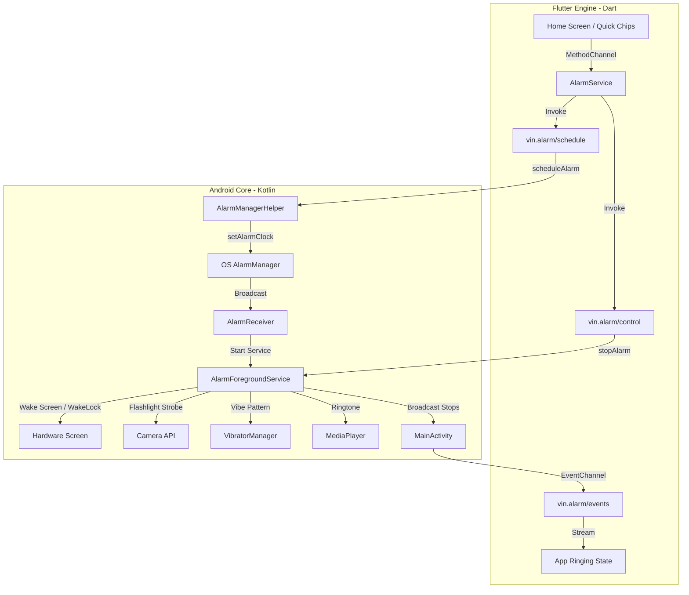

# ⏰ Vin's Alarm System

[](https://flutter.dev)
[](https://kotlinlang.org)
[](https://developer.android.com)
[](#design-system)

**Vin's Alarm System** is a high-performance, developer-focused quick alarm application built with Flutter and native Android integrations. Tailored for software engineers, it allows developers to quickly fire-up "BRB", lunch break, or urgent coffee reminders and ensures they *actually* get notified, even under the deepest Android power-saving and Doze states.

<p align="center">
  
</p>

---

## ⚡ The Developer's Chrono-Trigger

As developers, we often lose track of time when stepping away for a "15-minute break" or stepping out for lunch. Standard alarm apps are tedious to configure for quick, repeated sessions. **Vin's Alarm** solves this with a high-fidelity cyberpunk dark UI featuring instant preset chips ("BRB 15", "BRB 30", "Lunch 1 Hour") and a robust native background service that ensures your alarm triggers.

### Why this isn't just "another Flutter app":
*   **Bypasses Android Doze Mode:** Standard Dart timers fail when the screen locks. Vin's Alarm hooks directly into Android's low-level `AlarmManager` using high-precision alarm clocks.
*   **Multi-Sensory Ringing:** Fully customizable combinations of electric ringtones, complex vibration waveforms, and pulsating camera hardware flashlight strobes.
*   **Persistent Foreground Service:** Built with a native Kotlin `AlarmForegroundService` that stays active, wakes the screen, and alerts you even if the main Flutter app has been swiped out of memory.

---

## 🛠️ System Architecture & Native Bridge

The app is split into two halves: a high-framerate **Flutter UI client** and a **Native Android Core**. They communicate through structured `MethodChannel` and `EventChannel` lanes.



### 🛰️ The Native Channels API

#### 1. `vin.alarm/schedule` (Method Channel)
*   `scheduleAlarm`: Marshals parameters (trigger timestamp, alert modes, sound URIs, snooze configurations) into a bundle and programs Android's native `AlarmManager.AlarmClockInfo`.
*   `cancelAlarm`: Cancels pending intents for specific alarm hashes.
*   `getPendingAlarm`: Checks if the activity was launched by a system alarm intent, allowing the app to restore ringing screens on wake.
*   `pickRingtone`: Triggers the system ringtone selector activity and returns custom selected sound paths.

#### 2. `vin.alarm/control` (Method Channel)
*   `stopAlarm` / `snoozeAlarm`: Signals the running `AlarmForegroundService` to stop audio, vibration, and flashlight strobes, and updates scheduling stats.

#### 3. `vin.alarm/events` (Event Channel)
*   Broadcasts service lifecycle transitions (Ringing, Snoozed, Stopped, Timed out) in real-time to update the Flutter UI state dynamically.

---

## 🚀 Key Features & Native Details

### 🔋 1. Android Doze Prevention
Using standard alarms often fails on Android 6.0+ due to battery optimization states. Vin's Alarm schedules alarms using `AlarmManager.setAlarmClock(info, pendingIntent)`. Because it register an `AlarmClockInfo` object, the system treats it with the highest priority, waking the CPU from deep sleep.

### 🔦 2. Hardware Strobe & Custom Vibration (Kotlin)
The native Kotlin `AlarmForegroundService` controls hardware resources concurrently:
*   **Flashlight Strobe:** Accesses `CameraManager` and spawns a timed loop handler switching `setTorchMode(cameraId, true/false)` every 400ms to visually alert you if your phone is face-down on your desk.
*   **Haptic Patterns:** Employs `VibrationEffect.createWaveform` with structured delays (`[0, 700, 300, 700, 300, 1200, 500]`) to create an urgent, high-intensity buzz.

### 🛡️ 3. Strict Foreground Service & WakeLock
When the alarm fires:
1.  A CPU `WakeLock` is acquired (`PowerManager.SCREEN_BRIGHT_WAKE_LOCK` combined with `ACQUIRE_CAUSES_WAKEUP` and `ON_AFTER_RELEASE`).
2.  The screen is turned on even if locked, and a high-priority heads-up notification with a full-screen intent is pushed.
3.  The alarm auto-snoozes if it rings past the configured duration (default: 1m 30s) to preserve battery.

---

## 🎨 Design System

The app utilizes a premium, high-contrast dark visual language styled around focus and responsiveness:
*   **Palette:** Electric Indigo (`#6C63FF`), Neon Mint Teal (`#00D4AA`), and Deep Cosmic Black (`#0A0B14`).
*   **Typography:** The layout leverages **Google Fonts' Outfit** theme, combining high-legibility geometric headers with sleek tabular figures for clocks.
*   **UI Components:** Custom glassmorphic cards (`GlassCard`), dynamic pulsing icons, and micro-animated toggles for alarm switches.

---

## 📂 Project Structure

```
Vin-Alarm-System/
├── android/app/src/main/kotlin/com/vinalarm/vin_alarm_system/
│   ├── MainActivity.kt           # Native bridge, registers Method & Event Channels
│   ├── AlarmReceiver.kt          # Wakes on AlarmManager triggers, spawns service
│   ├── AlarmForegroundService.kt # Foreground service (media player, vibrator, flashlight)
│   └── AlarmManagerHelper.kt     # Low-level Alarm Clock scheduling utilities
├── lib/
│   ├── models/
│   │   └── alarm_model.dart      # Holds AlertModes (Sound, Vibrate, Flashlight) & model schema
│   ├── screens/
│   │   ├── home_screen.dart      # Main dashboard with Quick Alarm preset chips
│   │   ├── add_alarm_screen.dart # Custom time/ring-duration configuration
│   │   └── alarm_ringing_screen.dart # Screen shown on wake with Swipe to Stop/Snooze
│   ├── services/
│   │   ├── alarm_service.dart    # Client bridge class mapping Dart UI actions to channels
│   │   └── settings_service.dart # Local settings persistence
│   ├── utils/
│   │   └── app_theme.dart        # Outfit Typography & Neon Cyber Color tokens
│   └── main.dart                 # App initialization, system overlays, and state observers
└── pubspec.yaml                  # Dev tooling and asset declarations
```

---

## ⚙️ Setup & Installation

### Prerequisites
*   **Flutter SDK:** `^3.12.2`
*   **Android SDK:** Target API level `33` or higher (compatible down to API level `24`)

### Run App
1.  Clone the repository:
    ```bash
    git clone https://github.com/chichiarchi/Vin-Alarm-System.git
    cd Vin-Alarm-System
    ```
2.  Fetch package dependencies:
    ```bash
    flutter pub get
    ```
3.  Verify Android permissions (pushed automatically in Manifest):
    *   `android.permission.SET_ALARM`
    *   `android.permission.SCHEDULE_EXACT_ALARM`
    *   `android.permission.USE_EXACT_ALARM`
    *   `android.permission.FOREGROUND_SERVICE`
    *   `android.permission.WAKE_LOCK`
    *   `android.permission.CAMERA` (Required for flashlight strobe)
    *   `android.permission.VIBRATE`
4.  Connect an Android device and run:
    ```bash
    flutter run
    ```

---

## 📄 License
This project is proprietary and confidential. Developed under `Vin-Alarm-System`. All rights reserved.